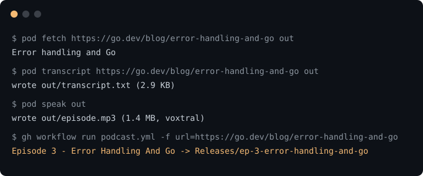

<p align="center"> 
      
     
     
    <a href=".github/workflows/checks.yml"></a> 
</p>

**sockpuppet** is a pipeline that turns written content into a narrated MP3. See recent episodes in the [Releases](https://github.com/nadiaenh/sockpuppet/releases) page. Each release contains the source content as-ingested, the narrated transcript, and the MP3.

<p align="center"></p>

## Setup

```sh
git clone git@github.com:nadiaenh/sockpuppet.git
cd sockpuppet
gh auth login
./setup.sh
```

## Usage

Trigger a run from the GitHub UI (Actions → "Generate new podcast" → Run workflow), or from the CLI:

```sh
gh workflow run podcast.yml -f url=https://x.ai/news/designing-grok-bot
gh workflow run podcast.yml -f url=https://x.ai/news/designing-grok-bot -f provider=elevenlabs
```

Run the pipeline locally against your `.env` keys:

```sh
mkdir -p out
go run . verify-keys
go run . fetch https://x.ai/news/designing-grok-bot out
go run . transcript https://x.ai/news/designing-grok-bot out
go run . speak out
go test ./...
```

## Demo


